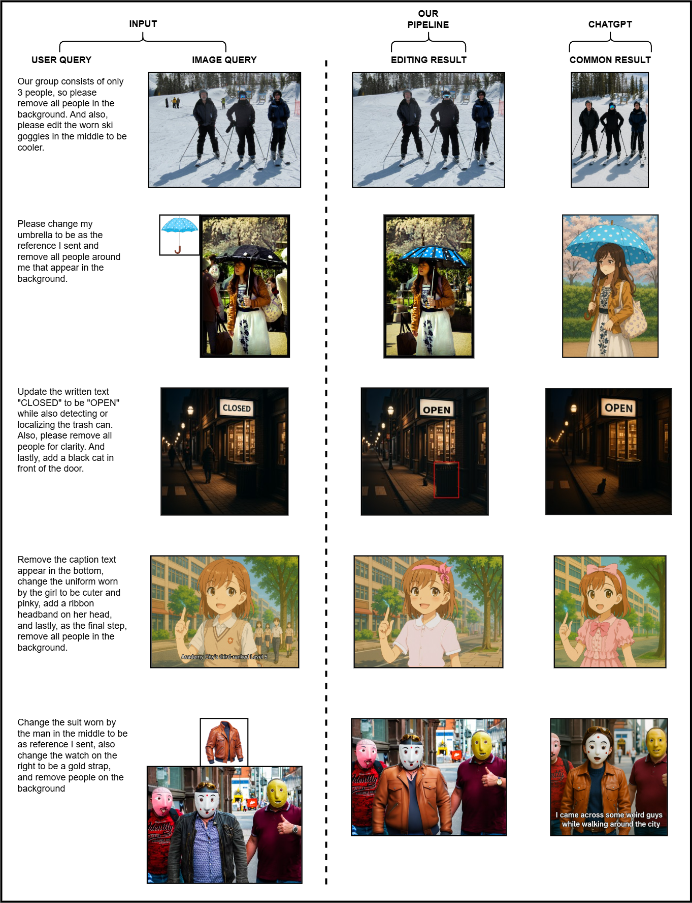
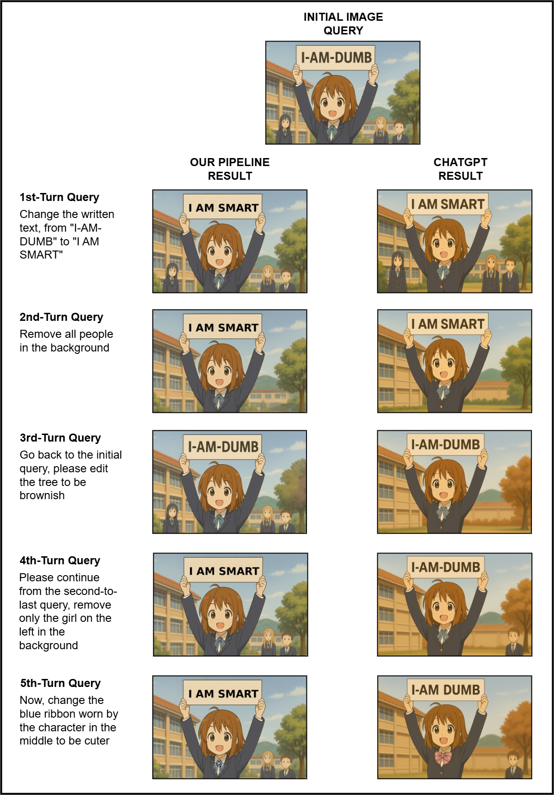

# Agentic AI Image Editor: Building a Multi-Turn, Multi-Agent Image Editing Stack

This repository implements a zero-shot image editing pipeline that unites multimodal reasoning, segmentation, and generative inpainting. Built on recent advances in vision–language models, the system translates natural instructions into grounded visual edits—supporting both text-guided and image-guided editing with minimal manual effort.

📝 You can read the full article here:  
👉 [Agentic AI Image Editor: Building a Multi-Turn, Multi-Agent Image Editing Stack – Medium](https://medium.com/@hanifsarubany10/agentic-ai-image-editor-building-a-multi-turn-multi-agent-image-editing-stack-c439b167a3a5)

---

## 🧠 Key Components

- **MCP Orchestration**: MLLM Planner on MCP client, tools on MCP server, streaming via SSE.  
- **Planner and Router**: Composes multistep jobs from a single query, selects and orders tools.  
- **Session Memory**: Stores checkpoints, regions, masks, and references; supports rollbacks and multi-turn continuity.  
- **Vision Grounding**: Qwen2.5-VL for reasoning over instructions and mapping them to image regions.  
- **Zero-Shot Segmentation**: SAM-2 guided by text, bounding boxes, or points, refined for crisp masks.  
- **Prompt Builders & Conditioning**:  
  - MLLMs (e.g., GPT-5, Llama-4) for segmentation and diffusion prompts  
  - IP-Adapter for reference image conditioning  
- **Editing Engines**:  
  - PrefPaint (SDXL-based) for human-aligned inpainting  
  - SDXL Inpaint / IP-SDXL for reference-driven edits  
  - ObjectClear for clean removals and background fill  
  - NVLabs Add-it for object insertion via diffusion  
  - CatVTON for garment try-on tasks  
- **Text & UI Tools**: PIL-based text drawer (auto-fit) and bounding-box renderer.  
- **Intermediate Store & Trace**: Saves outputs per step, enables partial undo and auditability.  

---

## 🖼️ Visual Examples

### 🔍 Multistep Editing Evaluation: Comparison with ChatGPT’s Native Image Editing
<p align="center">
  
</p>

> Our pipeline demonstrates superior multistep image editing accuracy compared to ChatGPT, particularly in tasks requiring visual reasoning and precise masking.

### 🔍 Memory Retention Evaluation: Comparison with ChatGPT’s Chat Pipeline
<p align="center">
  
</p>

> Our pipeline demonstrates superior memory preservation during chat conversation compared to ChatGPT.
---

### 🎨 Streamlit App – Frontend Overview
<p align="center">
  
</p>

---

## ⚙️ Reproducing the Environment

```bash
# Clone the VisionReasoner base repository
git clone https://github.com/dvlab-research/VisionReasoner.git
cd VisionReasoner

# Create and activate the conda environment
conda create -n image_editing python=3.12
conda activate image_editing

# Install dependencies
pip3 install torch torchvision
pip install -r requirements.txt
pip install git+https://github.com/tencent-ailab/IP-Adapter.git
pip install diffusers groq huggingface-hub python-dotenv
pip install uvicorn fastapi streamlit
```
---
## 📦 IP-Adapter Checkpoints
The IP-Adapter checkpoints must be downloaded manually. Make sure to place the correct path in your code when loading the adapter.
```bash
mkdir IP-Adapter
cd IP-Adapter
git lfs install
git clone https://huggingface.co/h94/IP-Adapter
```
---
## 🚀 Running the Application

Once you've set up the environment and downloaded the required models, you can launch both the backend and frontend with the following commands:

#### ✅ Run the Backend Server (FastAPI)
```bash
uvicorn main:app --port 8080 --reload
```
#### ✅ Run the Frontend (Streamlit)
```bash
streamlit run frontend.py
```
---
## ⚠️ Caution

This project requires **a high-end GPU with at least 48 GB of VRAM** to run all models (e.g., Vision Reasoner, SAM-2, and PrefPaint) efficiently in memory.

If you attempt to run this pipeline on hardware with less VRAM, you may encounter:
- Out-of-memory (OOM) errors
- Slow or failed inferences
- Inability to load large vision-language models

> 🖥️ This setup was tested using an **NVIDIA Quadro RTX 8000 (48GB VRAM)**. Performance may vary on different hardware.

---
## 📚 Citation
If you use this work, please consider citing the following foundational papers:
```bibtex
@article{liu2025segzero,
  title        = {Seg-Zero: Reasoning-Chain Guided  Segmentation via Cognitive Reinforcement},
  author       = {Liu, Yuqi and Peng, Bohao and Zhong, Zhisheng and Yue, Zihao and Lu, Fanbin and Yu, Bei and Jia, Jiaya},
  journal      = {arXiv preprint arXiv:2503.06520},
  year         = {2025}
}
@article{liu2025visionreasoner,
  title        = {VisionReasoner: Unified Visual Perception and Reasoning via Reinforcement Learning},
  author       = {Liu, Yuqi and Qu, Tianyuan and Zhong, Zhisheng and Peng, Bohao and Liu, Shu and Yu, Bei and Jia, Jiaya},
  journal      = {arXiv preprint arXiv:2505.12081},
  year         = {2025}
}
@article{liu2024prefpaint,
  title={PrefPaint: Aligning Image Inpainting Diffusion Model with Human Preference},
  author={Liu, Kendong and Zhu, Zhiyu and Li, Chuanhao and Liu, Hui and Zeng, Huanqiang and Hou, Junhui},
  journal={arXiv preprint arXiv:2410.21966},
  year={2024}
}
@article{ye2023ip-adapter,
  title={IP-Adapter: Text Compatible Image Prompt Adapter for Text-to-Image Diffusion Models},
  author={Ye, Hu and Zhang, Jun and Liu, Sibo and Han, Xiao and Yang, Wei},
  booktitle={arXiv preprint arxiv:2308.06721},
  year={2023}
}
```
